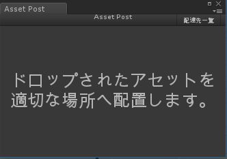
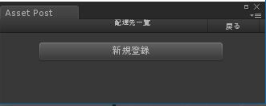
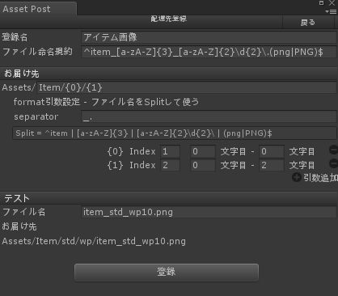

# AssetPost
ウィンドウにアセットをドロップすると、適切なフォルダに配置してくれるツールです。 
アセットパスを求めるのにファイル名を使用します。

アセットの命名規約を作り、取り込みをスムーズにしましょう！

ここにポイポイするだけ。 

## こんな時に便利
大量に存在するファイルを、命名規約に従って指定のフォルダにいけないとき。 
ファイル名やフォルダ名に誤字があってうまく認識されてなかった…などなど。 
こうしたヒューマンエラーを予防します。

# パッケージ
[パッケージファイルはこちら](./AssetPost.unitypackage)

# 使い方

## 起動はメニューから

> Tools > AssetPost

## 配置情報を設定

* アセットを自動配置するための情報（配達先情報）を設定する必要があります

* ウィンドウ右上の「配達先一覧」から設定を行います

* 最初は何もないので「新規登録」を選択 

* 配達先登録画面 

<pre>
例）設定例
命名規約：item_[カテゴリ3文字]_[属性2文字][ID2桁].png
配置先：Assets/Item/カテゴリ/属性/
</pre>
	* 登録名：一覧に表示する際の名前
	* ファイル命名規約：ドロップされたファイルを識別するための正規表現 
	* お届け先：そのファイルのAssetPathを設定します
		* Assets/の後ろにstring.Format()形式でまずは作成
		* formatに渡す引数は、ファイル名をsplitして指定します
		* separator：Splitに使うchar群を指定
		* index：Splitされた文字列のインデックス。マイナスを指定すると後ろから。
		* 開始と終了をそれぞれsubstringで。マイナスを指定すると後ろから。

## 保存先
ProjectSettings/AssetPostAddressbook.txt

